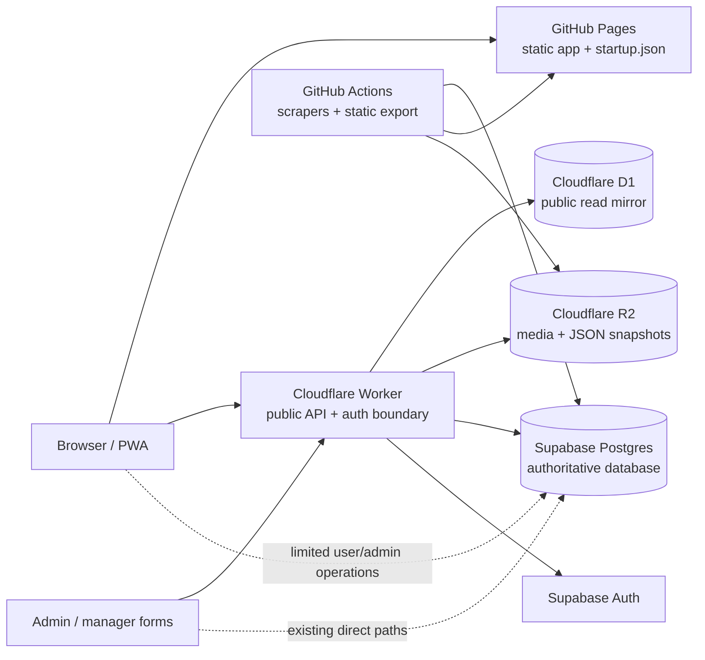
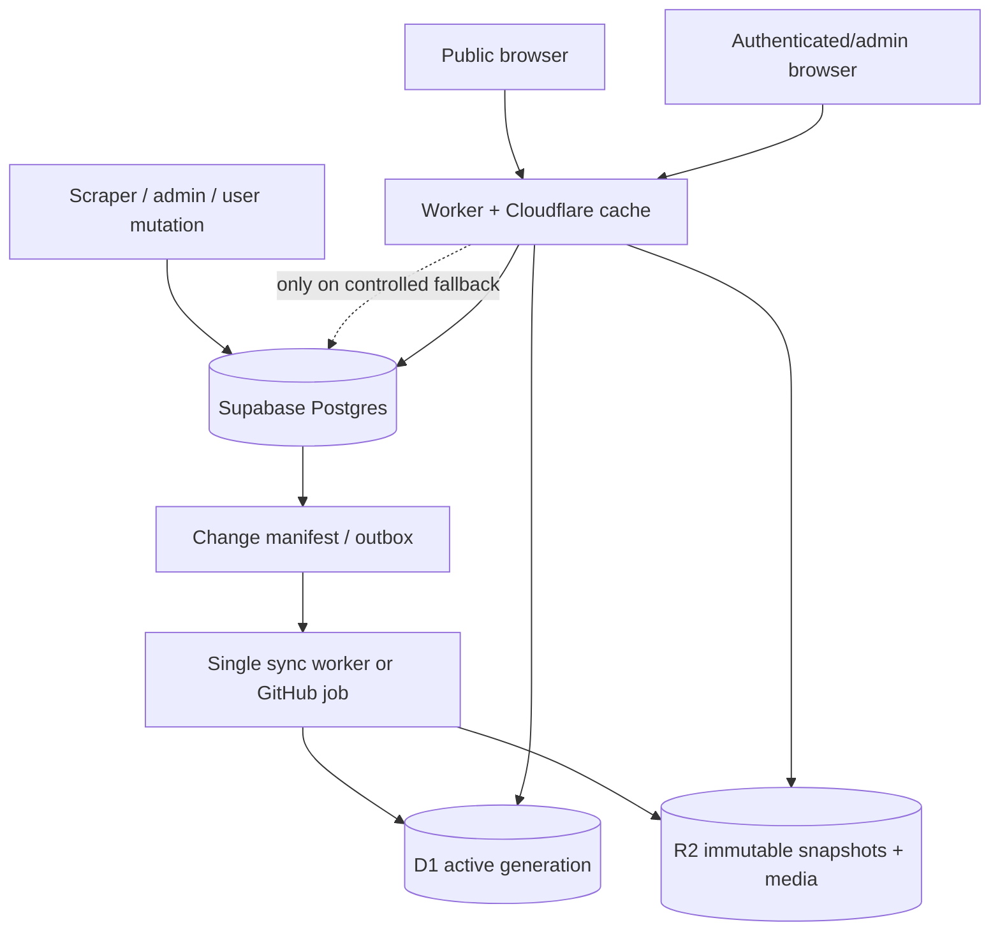

# SA Recruiters: Supabase, Cloudflare Worker, R2, and D1 Architecture

**Repository:** `kamogeloralph-ux/sarecruiters`

**Supabase project:** `SA.Recruiters` (`ythznnktswgymerdcxky`)

**Worker:** `sarecruiters-uploader`

**Document date:** 2026-10-05

**Purpose:** Explain how Supabase and Cloudflare work together in the app, identify the current causes of high Supabase egress and D1 usage, and define a safer lower-egress target architecture.

---

## 1. Executive summary

The app is already part-way through a sensible migration:

- **Supabase Postgres** is the transactional system of record for vacancies, agencies, employers, candidates, posters, authentication, settings, submissions, and admin data.
- **Cloudflare Worker** is the public API boundary and server-side integration layer. It exposes public reads, performs authenticated mutations, calls Supabase RPCs, and performs the D1 mirror sync.
- **Cloudflare D1** is a read-optimized mirror for public directory data. Public startup and vacancy reads should come from D1, not Supabase.
- **Cloudflare R2** stores media and cached public JSON snapshots, avoiding database storage and media egress for images/audio.
- **GitHub Actions / GitHub Pages** produce a static public snapshot and serve the static app shell.

The main problem is not that Supabase and D1 are used together. The problem is that the application currently has **multiple overlapping read paths**:

1. Static GitHub snapshot reads.
2. Worker → D1 reads.
3. Worker → Supabase fallback reads.
4. Browser → Supabase direct reads for several features.
5. Scheduled Worker D1 synchronization that reads Supabase and writes D1.
6. GitHub export jobs that independently read large Supabase tables.

This makes the system resilient, but it also makes data traffic difficult to predict. The solution is to make the boundaries strict:

> **Supabase accepts and stores authoritative writes. Cloudflare performs public reads. D1/R2 serve public data. The browser does not directly read large public tables except where a narrowly scoped user-owned or admin operation requires it.**

The highest-value actions are:

1. Make D1 the only public directory read source behind the Worker.
2. Remove or tightly limit Supabase fallback reads after D1 has a valid snapshot.
3. Replace broad six-hour full-table sync behavior with generation-based incremental synchronization.
4. Coalesce browser startup requests to exactly one public aggregate request.
5. Keep vacancy descriptions out of the startup payload and load them on demand.
6. Keep all media on R2 and make media URLs immutable and cacheable.
7. Add egress and D1 usage telemetry before changing quotas or architecture further.

---

## 2. Current architecture



### 2.1 Supabase responsibilities

Supabase currently provides:

- Postgres tables and relationships.
- Supabase Auth and user sessions.
- Row Level Security policies.
- Database functions/RPCs for controlled mutations.
- Admin and manager workflows.
- Scraper ingestion and cleanup staging.
- Public and user-owned reads that have not yet been moved behind the Worker.

Important current tables include:

| Table / view | Current role | Approximate live rows observed on 2026-10-05 |
|---|---|---:|
| `vacancies` | Main vacancy store and scraper target | 16,724 |
| `agencies` | Agency directory | 137 |
| `branches` | Agency branch directory | 103 |
| `employers` | Employer directory | 12 |
| `pool_candidates` | Private/user-owned talent pool data | 29 |
| `pool_candidates_public` | Redacted public talent-pool view | 29 source rows |
| `employer_posters` | Public vacancy poster feed | 29 |
| `analytics_events` | Anonymous product analytics | 845 |
| `reports` / `suggestions` | User submissions | Small |
| `daily_tracks` | Audio metadata | Small |
| `house_ads` | First-party promotional content | 2 |
| `app_settings` | Application configuration | 5 |

The `vacancies` table is the dominant relational table by size. The observed PostgreSQL total relation size was approximately **81 MB**, but database storage size is not the same as network egress. Egress is driven by bytes returned to clients and services, including repeated large `SELECT` responses.

### 2.2 Cloudflare Worker responsibilities

The Worker at `sarecruiters-uploader.kamogeloralph.workers.dev` currently provides:

- `GET /api/startup` — public startup aggregate.
- `GET /api/vacancies` — public paginated vacancy reads.
- `GET /api/sync-status` — protected sync status.
- `POST /api/sync-d1` — protected manual D1 synchronization.
- Authenticated manager mutation routes.
- Public Turnstile-protected submissions.
- Poster and file upload routes.
- Admin submission and account operations.
- R2 media storage and deletion.
- Scheduled D1 synchronization every six hours.

The Worker can read from:

- **D1** for public directory reads.
- **R2** for cached snapshots and media.
- **Supabase REST/RPC/Auth endpoints** for synchronization, fallback reads, authentication checks, and mutations.

### 2.3 D1 responsibilities

D1 is a **read mirror**, not the primary database. It currently mirrors public/read-oriented data such as:

- Agencies.
- Branches.
- Employers.
- Vacancies.
- Redacted pool candidates.
- Application settings.

The D1 mirror is intended to remove repeated public reads from Supabase. D1 reads do not count as Supabase egress. However, D1 synchronization itself consumes:

- Supabase response bytes during source reads.
- Worker requests and CPU time.
- D1 write operations and batch capacity.
- D1 storage and query work.

Therefore, D1 reduces Supabase egress only when the synchronization cost is lower than the public-read traffic it replaces.

### 2.4 R2 responsibilities

R2 should own large or frequently downloaded blobs:

- Candidate photos.
- Agency and employer logos.
- Vacancy photos.
- Employer vacancy posters.
- Daily-track audio.
- Public startup JSON snapshots.
- Public vacancy JSON snapshots.

The browser should receive media URLs pointing to R2, not binary media proxied through Supabase or Postgres.

### 2.5 GitHub Pages and static data

The repository contains a committed `data/startup.json` generated by GitHub Actions. The export job reads public rows from Supabase, filters live vacancies, applies per-poster caps, removes private fields, and commits the snapshot back to the repository.

This is a useful resilience layer, but it is also a second public-data pipeline alongside Worker/D1. The system should clearly define when the static snapshot is:

- The primary offline/first-paint source.
- A deployment artifact only.
- A fallback used only when the Worker is unavailable.

Without that contract, the same public data may be transferred through GitHub Pages, Worker/D1, and Supabase during a single page load.

---

## 3. Current data flows

### 3.1 Public directory startup

The intended path is:

```text
Browser
  → Cloudflare Worker /api/startup
  → D1
  → optionally R2 snapshot/cache
```

The Worker currently has a Supabase fallback when D1 is empty or unavailable. This is appropriate during bootstrap, but it should not remain an ordinary per-request fallback once a valid D1 snapshot exists.

The live `/api/startup` response observed on 2026-10-05 had:

- 137 agencies.
- 103 branches.
- 12 employers.
- 370 startup vacancy rows.
- 29 pool candidates.
- 16,724 total vacancy count.
- Approximately 623 KB decoded JSON.
- Gzip content encoding at the HTTP layer.

A 623 KB decoded response is manageable at low traffic, but it becomes significant when multiplied by repeated startups, cache misses, duplicate requests, and multiple global visitors. The startup response should remain bounded and should not grow with the entire vacancy corpus.

### 3.2 Public vacancy browsing

The intended path is:

```text
Browser
  → Cloudflare Worker /api/vacancies
  → D1 paginated query
```

The Worker has a D1 query path and a snapshot/R2 fallback. This is the correct direction. The important controls are:

- Enforce a maximum page size.
- Select only required columns.
- Use a stable cursor rather than deep offsets where possible.
- Never return full vacancy notes for every card.
- Cache identical public query responses at the Worker/edge layer.

### 3.3 Public poster feed

The current poster feed is still a direct browser → Supabase query:

```text
Browser
  → Supabase REST /employer_posters
```

That query requests up to 200 rows with an exact count. It is not the largest data source today, but it violates the desired public-read boundary and makes poster traffic contribute directly to Supabase request and egress usage.

Recommended future path:

```text
Browser
  → Worker /api/posters
  → D1 metadata or R2 JSON snapshot
  → R2 image URL for the selected poster
```

### 3.4 Public Talent Pool

The app uses both Worker and direct Supabase paths for pool candidate data. Public reads should use the redacted `pool_candidates_public` view only. Private profile reads and writes should remain authenticated and user-scoped.

Do not mirror raw `pool_candidates` into D1. The Worker source already correctly comments that only the redacted public view belongs in the public mirror.

### 3.5 Authenticated and admin flows

Authenticated workflows may continue to use Supabase for:

- Auth session management.
- User-owned records.
- Admin-only tables and operations.
- Database RPCs with server-enforced authorization.

However, admin pages currently make many direct Supabase table calls. This is acceptable for low-volume administration, but they should not use broad `select *` queries or repeatedly reload full tables. Admin list screens should use:

- Explicit column lists.
- Pagination.
- Status/date filters.
- Server-side admin authorization.
- Mutation responses that return only the changed row or an operation result.

### 3.6 Scrapers and static export

Scrapers write to Supabase as the staging and authoritative ingestion layer. The static export then reads all relevant public tables, including a paginated read of `vacancies`, and generates the GitHub snapshot.

This means a data refresh can create both:

1. Supabase egress from GitHub Actions reading the source tables.
2. Supabase egress from the Worker reading changed data for D1 synchronization.

That duplication is one of the clearest opportunities for improvement.

---

## 4. Where Supabase egress is currently generated

### 4.1 Public fallback reads

When the Worker cannot use D1 or when D1 is considered uninitialized, it reads multiple Supabase endpoints in parallel for startup data. This can include:

- Agencies.
- Branches.
- Employers.
- Vacancy subsets.
- Multiple vacancy count queries.
- Public pool candidate data.
- Featured vacancies.
- Per-employer vacancy counts.

Parallel requests improve latency but do not reduce total bytes. A single public cold-start can therefore cause many Supabase responses.

**Action:** Once D1 has a valid completed generation, do not fall back to Supabase for ordinary public reads. Return a stale-but-valid D1 snapshot or a controlled degraded response instead.

### 4.2 Browser direct reads

The browser directly calls Supabase for several features, including:

- Employer posters.
- Vacancies in some legacy paths.
- Agencies and employers in some legacy paths.
- Pool candidate counts and rows.
- Reports and suggestions.
- User-owned profile data.
- Saved vacancies and saved searches.
- Analytics events.

Every direct public read bypasses the Worker/D1 cache boundary. The most important migration targets are large public reads, not small user-owned reads.

**Action:** Move public directory, employer, poster, and pool listing reads behind Worker endpoints. Keep user-owned and admin calls direct only where there is a clear security and operational reason.

### 4.3 D1 synchronization

The current sync reads several Supabase tables and then upserts/deletes rows in D1. Vacancy synchronization is partly incremental using `updated_at` and a watermark. Other mirrored tables are synchronized with broader reads and reconciliation.

This is the right mechanism for reducing public egress, but it can be expensive when:

- The sync runs every six hours even when nothing changed.
- A table is read in full instead of using a change watermark.
- The same data is read by both GitHub export and Worker sync.
- The Worker performs a full table reconciliation to discover deletions.
- A failed sync triggers repeated retries or fallback reads.

**Action:** Use change tracking and a single ingestion/export pipeline wherever possible. Do not make D1 synchronization the only way to detect changes if an ingestion job already knows exactly which rows changed.

### 4.4 GitHub static export

`export-static-data.mjs` reads all agencies, branches, employers, vacancies, and the public pool view in pages of 1,000 rows. This is safe and avoids PostgREST truncation, but it is a substantial read on every successful static refresh.

The export is valuable for SEO, offline startup, and resilience. It should be retained, but it should be made more efficient by:

- Running only after meaningful source changes.
- Exporting from a prepared public snapshot rather than re-reading every table.
- Using a change watermark or database-side export view.
- Avoiding duplicate reads that D1 synchronization will immediately repeat.

### 4.5 Large media or legacy storage paths

Postgres egress is not the same as Supabase Storage egress, but both affect usage and cost. The current architecture intends to move large media to R2. Verify that:

- All new photos, posters, and audio use R2 URLs.
- No public page loads old Supabase Storage binaries unnecessarily.
- Audio is not eagerly downloaded before the user presses Play.
- Images are resized/compressed before upload and served with long-lived caching.

---

## 5. Where D1 usage is currently generated

D1 usage comes from both reads and writes.

### 5.1 D1 reads

Public traffic can produce D1 reads for:

- Startup aggregate assembly.
- Vacancy list queries.
- Counts and category folders.
- Employer/agency directory data.
- Pool candidate public reads.

D1 reads are still work even though they do not count as Supabase egress. They should be reduced through:

- R2 snapshots for stable aggregates.
- Worker Cache API or Cloudflare edge caching.
- Short public TTLs with stale-while-revalidate.
- Bounded result sizes.
- Avoiding repeated count queries per page load.
- One aggregate query rather than many independent queries.

### 5.2 D1 writes

D1 writes come mainly from the scheduled mirror sync:

- Upserts for changed rows.
- Cleanup/deletion of stale keys.
- Sync metadata updates.
- Snapshot metadata and R2 publication.

The current implementation uses batched writes, which is better than one request per row. However, the design still needs an atomic generation boundary. A partial sync can leave a mixture of old and new data visible.

### 5.3 D1 write amplification

D1 write amplification occurs when the sync rewrites unchanged rows or performs broad delete/reinsert operations. The repository has already moved away from the old `replaceD1Table()` approach and uses keyed upserts plus stale-key cleanup. That is a good improvement.

The next improvement is to make the source change-aware:

- Store a source `updated_at` or version for each row.
- Fetch only rows changed after the last successful watermark.
- Process explicit deletes from a tombstone/change table.
- Do not scan every D1 key on every synchronization if a deletion feed exists.

---

## 6. Recommended target architecture



### Target rules

1. **Supabase is authoritative for writes and relational integrity.**
2. **D1 is authoritative for public directory reads after a valid snapshot is published.**
3. **R2 is authoritative for media and immutable public JSON snapshots.**
4. **The Worker is the only public API boundary for large public reads.**
5. **The browser does not read large public Supabase tables directly.**
6. **Every D1 generation is complete before it becomes active.**
7. **A stale valid generation is preferable to a live Supabase fallback on every request.**
8. **A single source-change event should not trigger multiple full exports.**
9. **Large text fields are loaded on demand, not included in every card aggregate.**
10. **All public responses expose data age and source for observability.**

---

## 7. Priority implementation plan

### Phase 0 — Measure before changing quotas

Create a baseline for seven days:

- Supabase egress by day.
- Supabase REST request count by endpoint/table.
- Supabase response bytes by endpoint/table.
- Worker request count by route and status.
- Worker → Supabase request count and bytes.
- D1 reads and writes by route/job.
- R2 reads and writes by object prefix.
- Cache hit ratio for `/api/startup`, `/api/vacancies`, and poster feeds.
- Number of Supabase fallback requests from the Worker.
- Number of static export rows read.

Add structured request headers or logs:

```text
X-Data-Source: d1 | r2 | supabase | static
X-Data-Generation: <generation-id>
X-Data-As-Of: <timestamp>
X-Cache-Status: hit | miss | stale | bypass
```

Do not treat a database linter report as an egress report. The Supabase advisors currently provide useful security/performance findings, but they do not replace endpoint-level traffic measurement.

### Phase 1 — Stop duplicate public reads

1. Add Worker endpoints for:
   - `/api/posters`
   - `/api/agencies`
   - `/api/employers`
   - `/api/pool-candidates`
2. Populate those responses from D1 or R2 snapshots.
3. Change the browser feed code to use Worker endpoints.
4. Remove direct public `supabaseClient.from(...)` reads for those features.
5. Keep direct Supabase access only for authenticated user-owned data and tightly scoped admin operations.

### Phase 2 — Make startup one request

The app currently has multiple startup consumers and fallback paths. Implement one memoized startup promise:

```text
getStartupPayload()
  → one request per load generation
  → all startup consumers share the result
```

Requirements:

- Exactly one public aggregate request per page load.
- No second request solely for spotlight, registration settings, or counts.
- Abortable timeout.
- One bounded retry for transient failures.
- Static snapshot fallback only after Worker failure.
- No Supabase browser fallback for large public data.

### Phase 3 — Keep startup payload small

The live startup response observed on 2026-10-05 was approximately 623 KB decoded and contained only 370 vacancy rows, while the total vacancy count was 16,724. Keep that bounded behavior and improve it further:

- Include only card fields in startup.
- Keep descriptions/notes in `data/vacancy-notes.json`, R2, or an on-demand Worker endpoint.
- Load only the first page of each directory.
- Use cursor pagination for more rows.
- Do not include full pool candidate profiles in the startup aggregate if the page is not visible.
- Do not run per-employer count queries from the public path; precompute counts during sync.

### Phase 4 — Make D1 synchronization generation-based

Current sync metadata and batch writes are useful, but a production-safe mirror should use generations:

1. Create `sync_generations` metadata.
2. Sync into a new generation or staging tables.
3. Fetch and validate every source table.
4. Record source counts, row counts, checksum, and completion status.
5. Publish R2 snapshots for the completed generation.
6. Atomically switch one `active_generation` pointer.
7. Keep the previous generation for rollback.

A failed sync must never expose a half-updated public directory.

### Phase 5 — Remove periodic full reads

Replace the current broad sync pattern with one of these, in descending preference:

#### Option A: Supabase outbox/change manifest

Add an append-only change table containing:

- Table name.
- Row primary key.
- Operation: insert/update/delete.
- Source `updated_at`.
- Generation or event sequence.
- Created timestamp.

The Worker or a scheduled sync job consumes changes since the last acknowledged sequence.

#### Option B: Reliable per-table watermarks

For each mirrored table:

- Require an indexed `updated_at`.
- Track the last successful timestamp and tie-breaker ID.
- Fetch rows using `(updated_at, id) > (watermark, id)`.
- Track deletions separately.
- Periodically run a full reconciliation rather than on every sync.

#### Option C: Single prepared export

If a change manifest is not practical, have GitHub Actions generate one public snapshot from Supabase and publish it to R2. The Worker and GitHub Pages can both consume the same snapshot. This eliminates duplicate table reads by separate pipelines.

### Phase 6 — Move media completely to R2

For all media:

- Store only the R2 URL and metadata in Supabase.
- Use deterministic prefixes by media type.
- Resize images before upload.
- Set immutable object names, for example `posters/<hash>.jpg`.
- Set correct `Content-Type` and cache headers.
- Use `preload="none"` for audio.
- Never proxy public media through Supabase or the Worker unless access control requires it.
- Retain a cleanup job for orphaned R2 objects.

### Phase 7 — Apply database performance cleanup

Current Supabase advisors reported performance items that can increase query work, even when they are not direct egress causes:

- Five unindexed foreign keys.
- RLS policies that repeatedly evaluate `auth.uid()` per row.
- Multiple permissive policies on several tables.
- Duplicate indexes.
- Unused indexes.

Prioritize:

1. Add indexes for foreign keys used in joins/deletes.
2. Change RLS expressions to use `(select auth.uid())` where appropriate.
3. Consolidate overlapping permissive policies.
4. Remove duplicate indexes only after confirming query plans and usage.
5. Do not remove unused indexes blindly; validate with `EXPLAIN`, workload, and rollback.

Security advisors also reported a `pool_candidates_public` security-definer view and public/authenticated execution of multiple security-definer functions. These should be reviewed separately from egress optimization because changing them can affect authorization and user data exposure.

---

## 8. Concrete code-level changes

### 8.1 Public startup contract

Recommended response shape:

```json
{
  "schema": 2,
  "generated_at": "2026-10-05T18:00:35.871Z",
  "data_source": "d1",
  "generation": "2026-10-05T18:00:35.871Z-abc123",
  "stale": false,
  "agencies": [],
  "branches": [],
  "employers": [],
  "vacancies": [],
  "featured_vacancies": [],
  "counts": {},
  "settings": {}
}
```

The timestamp must describe the data, not the time the browser happened to receive it.

### 8.2 Public vacancy API

Use:

```text
GET /api/vacancies?cursor=<opaque>&limit=30&source=government
```

Return:

- A bounded page.
- `next_cursor`.
- `data_source`.
- `generation`.
- `data_as_of`.

Do not use unbounded `offset` pagination for large tables if cursor pagination is available.

### 8.3 D1 sync response

`POST /api/sync-d1` should return:

```json
{
  "status": "published",
  "generation": "...",
  "source_counts": {},
  "written_counts": {},
  "deleted_counts": {},
  "snapshot_checksum": "...",
  "started_at": "...",
  "completed_at": "..."
}
```

On failure:

- Preserve the previous active generation.
- Record the failure reason.
- Return a non-success status.
- Do not publish an incomplete R2 or D1 snapshot.

### 8.4 Cache policy

For stable public data:

- R2 immutable snapshots: long cache lifetime.
- Worker edge responses: short fresh TTL plus stale-while-revalidate.
- Browser startup aggregate: short TTL or revalidation, depending on update expectations.
- Authenticated/admin responses: `no-store` or private cache policy.
- Media: immutable URLs and long cache lifetime.

The cache policy must allow requests to reach Worker freshness logic when the Worker is responsible for revalidation. A one-day outer CDN cache can bypass the intended one-hour fresh / three-hour stale design.

---

## 9. What not to do

Avoid these changes:

- Do not move the entire Supabase database to D1.
- Do not mirror private candidate data into public D1.
- Do not let the browser query all 16,724 vacancies directly.
- Do not run a full Supabase export on every browser request.
- Do not refresh D1 on every public page view.
- Do not use D1 as the authoritative write database for relational/admin workflows.
- Do not solve egress by removing RLS or exposing service-role credentials.
- Do not add indexes solely because the advisor reports them unused; validate first.
- Do not publish a partially synchronized D1 dataset.
- Do not use a large startup aggregate to solve every route’s data needs.

---

## 10. Success criteria

The migration is working when the following are true:

| Area | Target |
|---|---|
| Public startup | One request per page load, normally served from D1/R2/edge cache |
| Public vacancy browsing | Worker → D1 only after first valid snapshot |
| Supabase public fallback | Near zero during normal operation; only bootstrap/degraded mode |
| Direct browser reads | Limited to authenticated user-owned/admin paths |
| D1 sync | Change-aware, batched, generation-based, and observable |
| D1 publication | Failed sync never changes the active public generation |
| Static export | Reuses a prepared snapshot or runs only after actual source changes |
| Media | R2-backed, cacheable, no eager audio download |
| Payloads | Explicit columns, bounded pages, no bulk notes in startup |
| Observability | Source, generation, cache status, bytes, and sync outcome logged |
| Security | RLS and security-definer functions reviewed independently of performance work |

Recommended initial operating budgets:

- **Public Supabase reads:** only authenticated/user-owned/admin reads plus controlled sync/export reads.
- **Worker Supabase fallback:** fewer than 1% of public startup/vacancy requests after D1 is healthy.
- **Startup aggregate:** no more than one request per browser load generation.
- **Startup decoded payload:** keep below 750 KB initially; target below 300 KB after route splitting and on-demand notes.
- **Vacancy page:** 20–50 rows maximum, explicit card columns.
- **D1 sync:** write only changed rows plus explicit deletes; full reconciliation no more than daily unless required.
- **Media:** zero public binary media reads from Supabase Storage after migration validation.

---

## 11. Recommended order for the next implementation sprint

1. Add route-level egress and D1 metrics.
2. Confirm the current D1 sync status and last successful generation.
3. Coalesce browser startup requests.
4. Move poster feed and public employer/agency reads behind Worker endpoints.
5. Stop Supabase fallback after a valid D1 generation exists.
6. Add generation-based D1 publication and rollback.
7. Add change-aware deletes/tombstones.
8. Unify GitHub static export and D1 snapshot generation where practical.
9. Move vacancy notes and other large fields fully on demand.
10. Review Supabase advisor findings in a separate security/performance migration.

This order reduces traffic before undertaking deeper schema changes, and it preserves Supabase as the safe source of truth while Cloudflare becomes the efficient public delivery layer.

---

## 12. Source files reviewed

- `STATIC_DATA_ARCHITECTURE.md`
- `PWA_RELIABILITY_AUDIT.md`
- `Cloudflare-worker/worker.js`
- `Cloudflare-worker/wrangler.toml`
- `Cloudflare-worker/README.md`
- `Cloudflare-worker/migrations/0002_incremental_vacancy_sync.sql`
- `Cloudflare-worker/migrations/0003_d1_sync_indexes.sql`
- `scripts/export-static-data.mjs`
- `scripts/d1-sync.test.mjs`
- `app-core.js`
- `app-data.js`
- `app-forms.js`
- `app-sheets.js`
- `app-ui.js`

Live Supabase project metadata, table counts, advisors, and Worker response headers were also checked on 2026-10-05. Supabase billing/egress dashboard totals were not available through the connected management interface, so this report identifies the code-level traffic sources and provides measurement requirements rather than claiming a precise monthly egress total.
